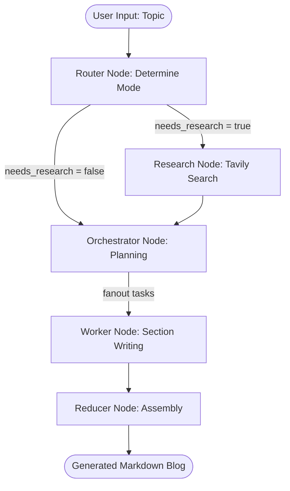

# LangGraph Blog Agent 📝

An AI-powered blog generation system using LangGraph, Langchain, and Groq to research and write high-quality technical blog posts. The agent utilizes Tavily for real-time web research and operates in an interactive Streamlit application.

## 🌟 Features

*   **Multi-agent LangGraph Workflow:** Dynamically routes between research and orchestration modes based on topic requirements.
*   **Automated Web Research:** Leverages Tavily Search to gather up-to-date evidence and context.
*   **Dynamic Planning:** An Orchestrator node creates a structured plan with specific sections, goals, and target word counts.
*   **Parallel Processing:** Fan-out architecture delegates section writing to parallel worker nodes for faster generation.
*   **Interactive UI:** A Streamlit interface to input topics, watch the agent's real-time execution log (including queries, evidence, and plans), and view/download generated Markdown blogs.

## 🏗️ Architecture Workflow

The system operates on a state graph defined by the following Mermaid diagram:



## 🚀 Prerequisites

*   Python >= 3.12
*   [Groq API Key](https://console.groq.com/) for LLM inference (using models like `llama-3.3-70b-versatile`).
*   [Tavily API Key](https://tavily.com/) for automated web research.

## 📦 Installation

This project uses `uv` for fast dependency management, but standard `pip` can also be used.

1.  **Clone the repository:**
    ```bash
    git clone https://github.com/yourusername/langgraph-blog-agent.git
    cd langgraph-blog-agent
    ```

2.  **Environment Variables:**
    Create a `.env` file in the root directory and add your API keys:
    ```env
    GROQ_API_KEY=your_groq_api_key_here
    TAVILY_API_KEY=your_tavily_api_key_here
    ```

3.  **Install dependencies:**
    If using `uv`:
    ```bash
    uv pip install -r pyproject.toml
    ```
    Or using standard `pip`:
    ```bash
    pip install dotenv ipykernel langchain-groq langchain-tavily langgraph streamlit
    ```

## 🎮 Usage

Start the Streamlit application:

```bash
streamlit run app.py
```

1.  Open your browser to the URL provided by Streamlit (usually `http://localhost:8501`).
2.  Navigate to the **🚀 Generate New Blog** tab.
3.  Enter a topic (e.g., "The Future of Multi-Agent Systems") and click "Generate Blog".
4.  Watch the agent's execution log as it routes, researches, plans, and writes.
5.  Go to the **📚 View & Manage Blogs** tab to read or download the final Markdown file.

## 📁 Project Structure

*   `app.py`: The main Streamlit web interface and agent execution visualizer.
*   `src/`: Core agent logic.
    *   `graph.py`: LangGraph state graph definition mapping nodes and edges.
    *   `nodes.py`: Implementation of individual agent nodes (Router, Research, Orchestrator, Worker, Reducer).
    *   `schemas.py`: Pydantic models for structured LLM outputs and Agent State.
    *   `prompts.py`: System prompts for guiding the LLM at each node stage.
*   `generated_blogs/`: Output directory where the final Markdown blog posts are saved.